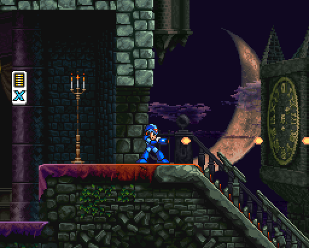

# Mega Dracula X



Mega Man X in Castlevania: Symphony of the Night

This project is a proof of concept for adding custom playable characters in Castlevania: Symphony of the Night.

Developers are encouraged to use this repository, fork it, and iterate on the existing source for their custom characters.

## Build guide

You will need to run `pip3 install -r requirements.txt` at least once to make the embedded Python tools to work. They are responsible in tasks such as generating the spritesheet or the palette for the custom character.

### Build guide via GCC

This is the easiest way to build your custom character for the PlayStation 1 version of SOTN. Follow the [Build guide](https://github.com/Xeeynamo/sotn-decomp/wiki/Build) to ensure you can build sotn-decomp locally (this must be done at least once).

Once set up, you can build your custom character using `make`.

### Build guide via CMake

This is a more advanced, work-in-progress method for building custom characters cross-platform. It allows you to target multiple platforms, including PlayStation 1 and PlayStation Portable.

Open `sotn-decomp/CMakeLists.txt` and add the following lines before `add_library(core ${SOURCE_FILES_CORE})`:

```cmake
set(SOTN_MMX_DIR ${CMAKE_SOURCE_DIR}/..)
include(${SOTN_MMX_DIR}/mmx.cmake)
list(TRANSFORM SOURCE_FILES_MMX PREPEND ${SOTN_MMX_DIR}/)
set(SOURCE_FILES_CORE ${SOURCE_FILES_CORE} ${SOURCE_FILES_MMX})
```

Before invoking `cmake`, follow the GCC build guide and run `make` at least once.

## Developing a custom character

It is highly recommended to begin by forking this repository. Doing so will automatically provide you with the necessary fundamentals to [distribute your character](https://github.com/xeeynamo/sotn-player-mmx/releases), [track bugs](https://github.com/xeeynamo/sotn-player-mmx/issues), Allow others to [propose tweaks and enhancements](https://github.com/xeeynamo/sotn-player-mmx/pulls), maintain a [list of custom characters for SOTN](https://github.com/Xeeynamo/sotn-player-mmx/forks) and share knowledge about your development process. This also supports the authors of [sotn-decomp](https://github.com/Xeeynamo/sotn-decomp/graphs/contributors).

### Creating sprites

The custom character spritesheet is located at `assets/spritesheet.png`. It is a 4bpp (16 colors) PNG image. Each sprite is arranged in a 96x96 grid, and this behavior can be changed in `tools/spritesheet.py`.

Every time the spritesheet is modified, building the game will generate the content in the `sprites/` folder. This folder will contain each frame, split and trimmed. Frames will be collected via `sprites/config.json`, which describes the X and Y coordinates of the sprite’s center. Modifying the X/Y center coordinates ensures that the character remains centered and does not warp during animation. Since everything in the `sprites/` folder is generated, you will need to manually run `make spritesheet` after modifications to make changes persistent in `assets/spritesheet.png`.

I highly recommend using [Aseprite](https://github.com/aseprite/aseprite) to edit your sprites (it’s free if you compile it yourself). Aseprite allows you to paste frames in your spritesheet while retaining the palette order and automatically mapping the colors.

### Creating your custom palette

Your custom palette is located in `assets/pal.yaml`, which holds a list of palette files. Running `make` will create the file `src/assets/pal.inc`, which can then be included and used in the game. Each file is a simple JASC-PAL file, which can be used with Aseprite or any text editor.

By default, this player sample uses `PLAYER.palette = 0x8120;`. Ignore the `0x8000` and focus on `0x120`, which is the palette entry that starts at `g_Clut + 0x1200`. This is why the sample code uses `memcpy(g_Clut + 0x1200, pl_palettes, sizeof(pl_palettes));` when installing the palette array. If you want to use the second palette from `pal.yaml`, you’ll need to programmatically change the palette using `PLAYER.palette = 0x8121;`, and so on.

To create an animated palette for your character, add a function to be called every frame with the following:

```c
RECT vramPalette = {0, 240, 256, 16};
LoadImage(&vramPalette, g_Clut + 0x1000);
```

Modify the palette data starting at `g_Clut[0x1200]`. Keep in mind that this is an expensive operation for the PSX hardware, so you may want to tweak the `RECT` to upload a smaller portion of data instead of the whole palette to improve the performance.

### Creating player animations

Animations are defined in `src/pl_anims.c` and follow this format:

```c
static AnimationFrame anim_fall[] = {
    {8, FRAME(20, 4)},
    {80, FRAME(21, 4)},
    A_END};
```

The first number is the number of half-frames the frame will remain on the screen before moving to the next frame. If you want your frame to stay on the screen for four frames, use 8 (double the frame count).

The `FRAME` macro accepts two parameters: the Frame ID and the Hitbox ID. For example, specifying Frame ID `20` will display the 20th frame in `sprites/`.

Each animation requires a terminator, which can be one of the following:

* `A_END` Freezes the animation on the last frame.
* `A_LOOP_AT` Loops the animation, starting from the specified frame index.
* `A_JUMP_AT` Terminates the current animation and jumps to another animation with its own set of frames.

## Distributing your custom character

TODO: CI
